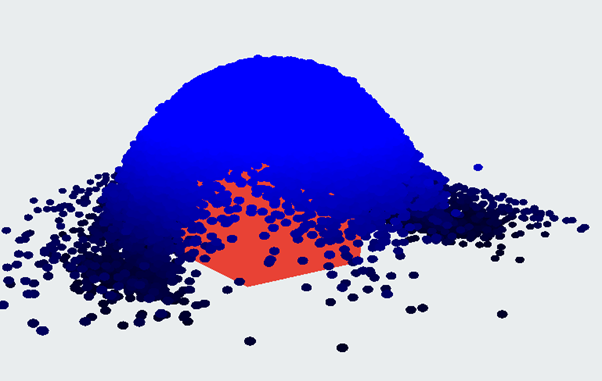

# SPH
A ,real time, GPU-based fluid simulation using smooth particle hydrodynamics done as a solo project for my Computer Animation (COMP 6311) class in Concordia University, Montreal.

The project is written in c++ and the rendering is done using OpenGl, all SPH computations occur in the GPU through the use of compute shaders.

### External Libraries Used
- GLFW
- Glad
- ImGui

### Functionality

#### Parameter Tuning
Through the ImGui UI the user can manipulate the parameters of the SPH simulation.
These parameters include the dynamic viscocity coefficient, the number of particles and more.
Warning, at the extremes the parameters become unstable and may result in unexpected behavior.

#### Bounding Box Tuning
The scale of the bounding box can be manipulated in real time, the outline can also be toggled on or off

#### Object Tuning
An object can also be added to the scene, this object can collide with the smoothed particles and multiple
object configurations can be explored
